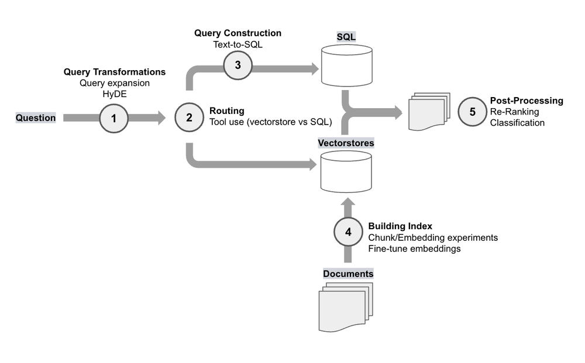

# rag
The next wave, rag is all you need
# **Applying OpenAI's RAG Strategies**



- KEY MESSAGE
    - **The ability to understand and these methods on your application is critical: from talking to many partners and users, there is no "one-size-fits-all" solution because different problems require different retrieval techniques.**
- Query Transformation
    - Query expansion
    - HyDE
- Routing
- Query Construction
- Building Index
    - Chunk/Embedding experiments
    - Fine-tune embeddings
- Post-Progressing
    - Re-Ranking
    - Classfication

## [Query Transformation](https://blog.langchain.dev/query-transformations/)

- https://github.com/texttron/hyde

| Aspect | Problem | Resolution with HyDE |
| --- | --- | --- |
| Retrieval | Inefficient zero-shot retrieval | Enhances zero-shot performance using language models |
| Data Dependency | Heavy reliance on labeled data | Operates effectively without needing human-labeled data |
| Generalization | Limited adaptability across languages and tasks | Improved generalization across various languages and tasks |

### **[MultiQueryRetriever](https://python.langchain.com/docs/modules/data_connection/retrievers/MultiQueryRetriever)**

- For example
    - ****Who won a championship more recently, the Red Sox or the Patriots?****
    
    　　　　　　　　　　　　　　　　　　↓
    
    - "When was the last time the Red Sox won a championship?"
    - "When was the last time the Patriots won a championship?"
- Implementation
    1. unable to install the chromed, grpcio
    
    ```
    CFLAGS="-I/Library/Developer/CommandLineTools/usr/include/c++/v1 -I/opt/homebrew/opt/openssl/include" LDFLAGS="-L/opt/homebrew/opt/openssl/lib" pip3 instal grpcio
    ```
    
    1. I cannot use the OpenAI text embedding model, use hugging face model
    
    ```python
    from langchain.embeddings import HuggingFaceEmbeddings
    embeddings = HuggingFaceEmbeddings(model_name="all-MiniLM-L6-v2")
    ```
    
    1. Use Azure Open AI instead of OpenAi API
    
    https://api.python.langchain.com/en/latest/embeddings/langchain.embeddings.openai.OpenAIEmbeddings.html#
    
    1. Resolve the chroma db issue
    
    ```python
    RuntimeError: Your system has an unsupported version of sqlite3. Chroma                     requires sqlite3 >= 3.35.0.
    Please visit                     https://docs.trychroma.com/troubleshooting#sqlite to learn how                     to upgrade.
    ```
    
    - refer the [site](https://docs.trychroma.com/troubleshooting#sqlite) to solve the issue to add three lines at the beginning of the code
    
    ```python
    __import__('pysqlite3')
    import sys
    sys.modules['sqlite3'] = sys.modules.pop('pysqlite3')
    ```
    
    - refer
    
    [Deep Dive into the Internals of Langchain Vector Store Retriever](https://rito.hashnode.dev/deep-dive-into-the-internals-of-langchain-vector-store-retriever)
    
    
    
    **TO READ**
    
    **[9 Methods to Enhance the Performance of a LLM RAG Application](https://tam159.medium.com/9-methods-to-enhance-the-performance-of-a-llm-rag-application-3bedfdc842e1)**